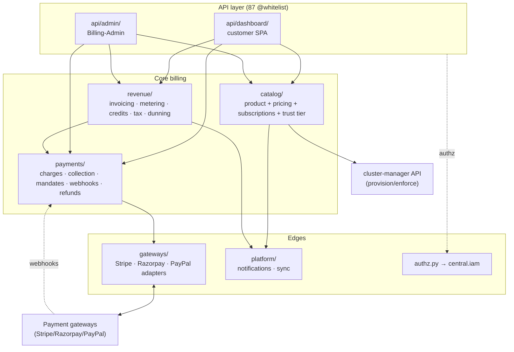
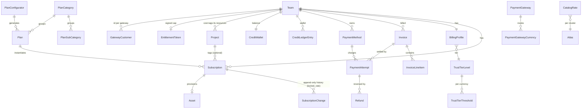
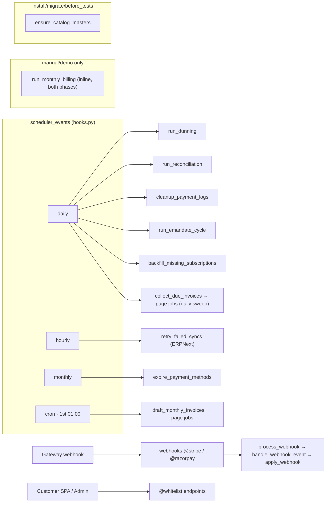
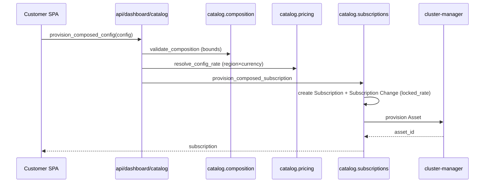
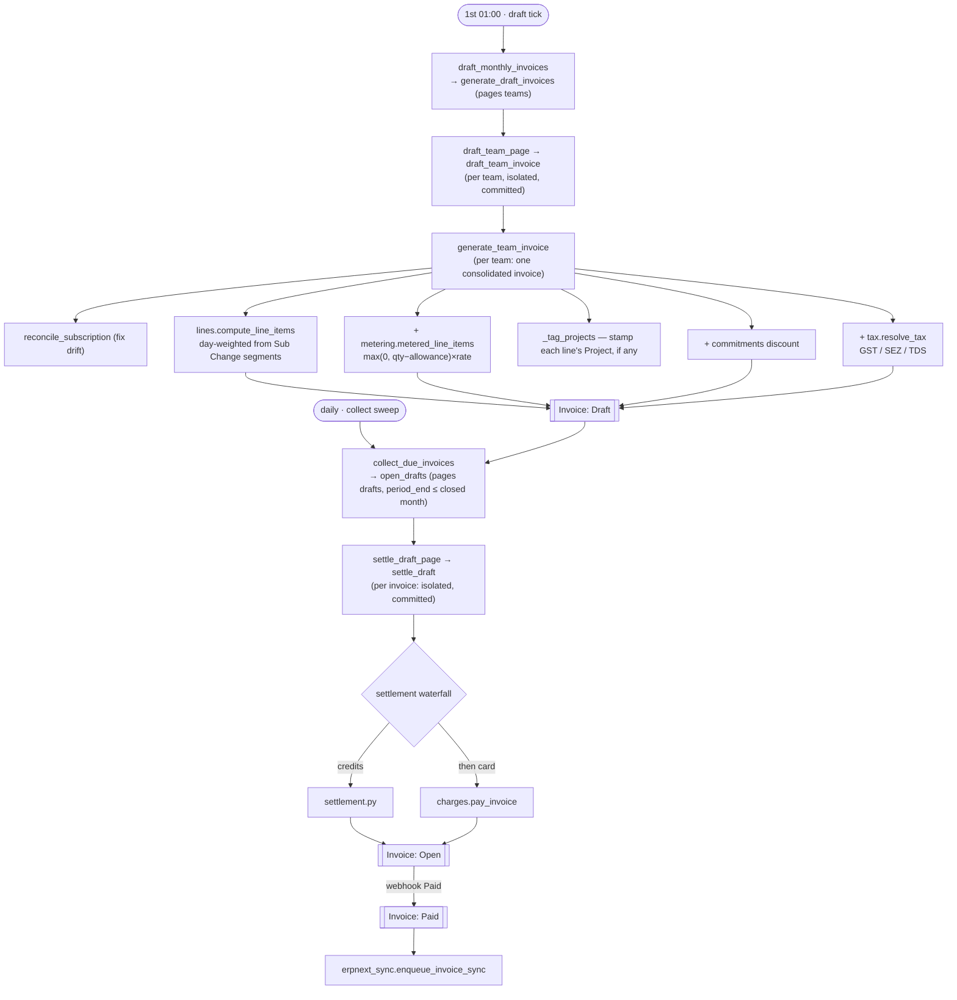
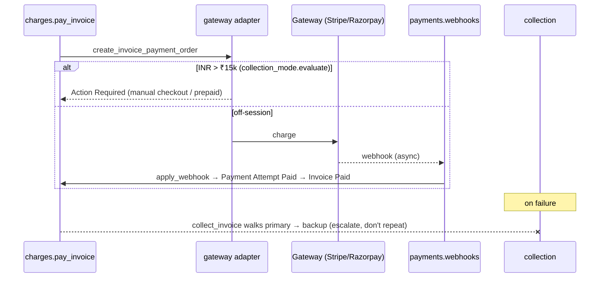
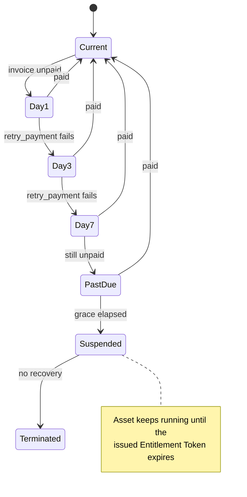
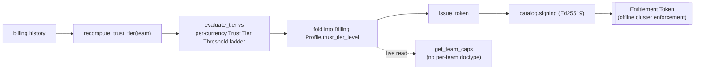

# Billing — Architecture & Debugging Map

> A glance-view of the `central.billing` module: what the sub-modules are, how they
> link, what triggers them, and where to look when something breaks. Start here, then
> jump to the named file. Paths are relative to `central/billing/`.
>
> 👉 To **stand up & demonstrate** billing from an empty site, see
> [`SETUP-AND-DEMO.md`](./SETUP-AND-DEMO.md).

Billing is a **postpaid, in-arrears** money system: Central provisions resources, records
the runtime it bills from, draws up an invoice in arrears, settles it (credits → card),
and chases the unpaid ones. There is **no Subscription Agent** (ADR 0006) — Central
provisions/records/enforces directly. Authorisation is Central's capability IAM
(ADR 0004), not billing-owned roles.

- **36 DocTypes**, **~10 sub-packages**, **87 whitelisted endpoints**.
- Money is **float `Currency` in major units** (₹10.00 is stored `10.0`). Conversion to gateway minor
  units (Razorpay paise / Stripe cents) happens **only at the gateway boundary**. ADR 0003
  (integer minor units) is **DEPRECATED — it was never implemented**; don't design against it.

---

## 1. Layered sub-module map



Read top-to-bottom — each layer calls the one below it.

| Layer | Package | What it owns |
|---|---|---|
| **API — customer** | `api/dashboard/` | Team-scoped reads/actions for the customer SPA (`account`, `catalog`, `invoices`, `methods`). |
| **API — admin** | `api/admin/` | Billing-Admin views: `catalog`, `revenue` (cost-explorer), `teams`, `gateways`. |
| **Catalog** | `catalog/` | The product & pricing authority: taxonomy masters, Plan Configurator, composed-config pricing, rate resolution, subscriptions (intent + state), trust tiers, entitlement signing. |
| **Revenue** | `revenue/` | Turning usage into money: `invoicing/` (draft→open→collect), `metering`, `credits`, `tax`, `commitments` discount, `dunning`, `pricelock`, `erpnext_sync`. |
| **Payments** | `payments/` | Moving the money: `charges`, `collection` (fallback), `collection_mode` (INR ₹15k gate), `mandates` (UPI), `emandate` (RBI), `payments` (cards), `webhooks`, `reconciliation`, `refunds`, `settlement`, `profile`. |
| **Gateways** | `gateways/` | The adapter seam: `base.GatewayAdapter` + `stripe`/`razorpay`/`paypal` + `registry`. |
| **Platform** | `platform/` | `notifications` (sole sender), `sync` (record the runtime billed from). |
| **Authz** | `authz.py` | Capability checks (delegates to `central.iam`). |

Cross-cutting reference data: `india_gst.py`, `regions.py`, `catalog/taxonomy_setup.py`.

---

## 2. Data model — the DocType graph



Grouped by concern. `→` = Link field; **[C]** = child table; **[S]** = submittable; **[1]** = single.

**Catalog / product**
```
Resource Type
Plan Category ──allowed_resource_types─→ [C]Plan Category Resource Type ─→ Resource Type
Plan Sub-Category ──category─→ Plan Category
Plan ──category─→ Plan Category, ──sub_category─→ Plan Sub-Category, ──includes─→ [C]Plan Includes ─→ Resource Type
Catalog Rate ──priced_doctype─→ DocType, ──priced_for─(dynamic)→, ──cluster─→ Atlas Instance, ──currency
Plan Configurator ─→ Category, Sub-Category, [C]base_rates, [C]rungs(─→Plan), [C]simple_plans(─→Plan)
```

**Subscription / state**
```
Subscription ──team, ──plan, ──sub_category, ──includes, ──default_payment_method,
             ──gateway, ──asset_id─→ Asset, ──project─→ Project
Subscription Change ──subscription, ──team, ──currency      (append-only history + locked_rate)
Price Lock ──team, ──plan                                    (RETIRED — see §6; rate now lives on Subscription Change)
Project ──team, ──title, ──enabled, ──spending_limit          (cost-tag + run-rate cap; see §2.1)
```

**Invoice / money**
```
Invoice [S] ──team, ──items─→ [C]Invoice Line Item
Invoice Line Item ──project, ──project_title                  (snapshot tag, stamped at generation; see §2.1)
Payment Attempt ──invoice, ──team, ──gateway, ──payment_method
Refund ──payment_attempt, ──invoice, ──team
Credit Ledger Entry ──team, ──currency                        (append-only)
Credit Wallet ──team                           (lock anchor / cached balance — one per (team,currency))
Commitment [S] ──team, ──currency              (spend floor)
Usage Rollup ──team                            (metered aggregation)
```

**Payment plumbing**
```
Billing Profile ──team, ──currency, ──country, ──trust_tier_level   (currency = source of truth, locks after activity)
Payment Method ──team, ──gateway
Payment Gateway ──currencies─→ [C]Payment Gateway Currency
Gateway Customer ──team, ──gateway             ((team,gateway) → customer_id)
Tax Profile ──team
```

**Trust tier / entitlement**
```
Trust Tier Level ──thresholds─→ [C]Trust Tier Threshold ──currency   (per-currency thresholds)
Entitlement Token ──team       (Ed25519-signed cap)
```

**Plumbing / logs**
```
Webhook Event ──gateway        | Billing Notification Log ──team
```

### 2.1 Project — cost tagging + a spending limit, one bill

A **Project** is a user-defined tag a team applies to its own Subscriptions — e.g. to
see what one internal team or customer costs inside an otherwise-shared bill. It is
**purely a cost-attribution + guardrail concept**: the team is always billed on **one
consolidated invoice per period**, exactly as if Projects did not exist. Tagging a
resource into a Project never changes who is billed, when, or on how many invoices.

**Invoice breakdown.** Every billable line (fixed or metered) is stamped with the
Project its resource is tagged into, if any — `Invoice Line Item.project` /
`project_title` — a snapshot taken at generation time (`revenue/invoicing/generate.py`'s
`_tag_projects`, called from `_rate`, the one function every line passes through for
both a real Invoice and a live forecast/cycle-tray read). An untagged resource, or one
tagged into a disabled Project, simply carries no project on its lines — it still bills
normally, just without a label. `Invoice.period_key` is plain
`team|period_start|period_end` (ADR 0018, invariant I6) — a team is billed at most once
per period, full stop; Projects add no dimension to that grain.

**Spending limit.** A Project optionally carries `spending_limit` — a cap on its
**committed monthly run-rate** (the summed `locked_rate` of every subscription tagged
into it, `catalog.subscriptions.project_run_rate`). `Subscription.validate_project`
calls `catalog.subscriptions.enforce_project_headroom` whenever a subscription is newly
tagged into a Project (on insert, or when its `project` field changes), and refuses the
tag if the addition would push the Project's committed run-rate past its limit. This
blocks **new tagging only** — an already-tagged, already-running subscription is never
throttled or stopped by a limit added or lowered later; the same "blocks new, never
touches existing" shape as trust-tier headroom (`enforce_headroom`), scoped to one
Project instead of the whole team. 0 or unset = unlimited.

**No delete** — a Project with billing history is load-bearing (past Invoice Line Items
carry its name/title as a snapshot); disabling (`Project.enabled = 0`) is the retirement
path. `Subscription.validate_project` refuses a *new* tag onto a disabled Project for
the same reason it refuses a foreign one: silently tagging something that means nothing
would be worse than refusing it outright. Disabling does not untag existing
subscriptions, and re-enabling resumes tracking with no retagging needed.

**Deliberately out of scope**: Projects have no relationship to credits or payment
methods at all — there is one `Credit Wallet` per (team, currency) and one Payment
Method fallback order per team, neither scoped by Project in any way (an earlier
per-group credit-budget / card-earmarking design was tried and removed — see §6). A
team-level Commitment (volume discount) and cost projection both operate on the team's
whole set of resources; a Project is never a unit either reasons about, only a label
lines carry.

---

## 3. Trigger surface — what fires what



### Scheduled (`central/hooks.py` → `scheduler_events`)
| Cadence | Entry point | Purpose |
|---|---|---|
| daily | `revenue.invoicing.collect_due_invoices` | phase 2 — sweep every Draft whose month has closed, fan drafts out as page jobs |
| daily | `revenue.dunning.run_dunning` | Day 1/3/7 retries → past_due → suspend → terminate |
| daily | `payments.reconciliation.run_reconciliation` | charged-but-never-webhooked gateway scan |
| daily | `payments.charges.cleanup_payment_logs` | prune Payment Attempt / Webhook Event |
| daily | `payments.emandate.run_emandate_cycle` | INR ≤₹15k pre-debit notice → debit after 24h |
| daily | `catalog.subscriptions.backfill_missing_subscriptions` | Subscription for any Running Asset missing one |
| hourly | `revenue.erpnext_sync.retry_failed_syncs` | retry Sales Invoice push (backoff window elapsed) |
| monthly | `payments.payments.expire_payment_methods` | flip cards past their printed month |
| cron `0 1 1 * *` | `revenue.invoicing.draft_monthly_invoices` | phase 1 — hand the month's teams out as page jobs |

**The monthly run is two ticks, and neither of them does the work.** Each is an
orchestrator: it keyset-pages its subjects and enqueues a **page job** per slice —
`draft_team_page(after, until)` / `settle_draft_page(cutoff, after, until)` —
deduplicated on the slice's upper bound. A page job re-derives its slice from the
bounds and works it in order, committing after **each team / each invoice**: the page
is the unit of *scheduling*, the team is still the unit of *work*, so a job killed
at team 300 of 500 keeps the 299 it finished.

Drafting fires once, on the 1st; collection is a **daily** sweep, not a single tick a
fixed few hours later. At scale drafting can still be running when a one-shot collect
would fire, and that scan would collect only the drafts that existed at that instant
and orphan the rest — with no later pass to catch them. `collect_due_invoices` instead
opens every Draft whose month has closed (`period_end <= the just-closed month`) and
re-runs daily until nothing is owed, so a late draft, or one a settle page left behind
(this month's or an older run's), is swept up rather than stranded. A settled draft
drops out of the scan, so once the run has drained the sweep is a cheap indexed no-op.

Not a job per team, deliberately. At a million teams that is a million redis
round-trips in one scheduler tick — a cron job runs on a **300-second** timeout
(`get_queue_name()` gives cron jobs the `default` queue), so it would be killed
around 150k teams having never handed out the rest, and a million queued jobs is
gigabytes of redis. Two thousand page jobs cost seconds and megabytes.

**The billing queue is the throughput knob and the rate-limit cap, at once.** The run
uses its own queue, not `long`, configured in `common_site_config.json`:

```json
"workers": {"billing": {"timeout": 3000, "background_workers": 8}}
```

Because a page job works its invoices *sequentially*, the number of billing workers
is exactly the number of gateway charges in flight. That is the only thing standing
between a million-invoice month and a wall of 429s — there is no token bucket yet, so
**this number is the rate limit**. Set it against the gateway's documented ceiling
(Stripe ≈ 100 req/s; a charge is ~2s, so W workers ≈ W/2 req/s). Raising it is how
you go faster; there is no other dial. `billing_queue()` falls back to `long` with a
warning if the bench hasn't declared the queue — enqueuing to a queue nobody consumes
would mean the month silently never gets billed.

A unit that fails is contained: logged to the billing log file *and* as a
`Billing Run Failure` Error Log row, rolled back to its own savepoint, and re-attempted
by the next tick since both phases are idempotent. If the savepoint itself is gone —
the database restarted, the connection dropped — the failure is **re-raised** instead:
that is the machinery breaking, not a bad team, and containing it would turn one
outage into a silent run in which nobody was billed.

Why both ticks land on the 1st rather than the documented 28th/1st: a calendar month
billed in arrears is not closed until it ends, so drafting on the 28th would bill days
that had not happened. The split that matters is heavy-local (rating) vs slow-external
(gateway), and that is preserved — five hours apart on the same morning.

`run_monthly_billing` still runs both phases inline for demos, small sites and manual
re-runs. `billing_run_status()` reports what the current period's run has actually
achieved (drafted / pending / collected / failures), derived from the tables rather
than from a counter — read it before deciding to re-fire a tick.

**Worker math.** One collected invoice ≈ 2s (rating is ~100ms; the rest is the gateway
round-trip). Sequentially, a million invoices is ≈ 23 days. Over W billing workers it is
1M × 2s / W: **8 workers ≈ 69h, 32 ≈ 17h, 64 ≈ 9h** — and 64 workers is ~32 charges/s,
still inside a 100 req/s gateway ceiling. Drafting is cheaper (~0.3s/team): 1M teams
over 32 workers ≈ 2.6h, which does *not* fit the five-hour gap with much room to spare
at that scale — widen the gap or the pool before you get there. Size the pool from the
team count, never from the invoice amount.

**What the run actually contends on.** The tables a draft reads — Subscription,
Subscription Change, Payment Method, Catalog Rate, Usage Rollup — are read with plain
consistent reads, which under InnoDB MVCC take **no locks at all**, so no number of
workers can make them block each other. Credit Wallet *is* locked `FOR UPDATE`, but the
key is (team, currency): a team only ever contends with its own concurrent top-up.

There is exactly one **global** lock in the run, and it is not a data table. Every
Invoice insert calls `make_autoname("INV-YYYY-MM-.#####")`, which takes the `tabSeries`
row `FOR UPDATE` and holds it **until the transaction commits** — so every worker in
the run queues behind one row. Measured on a dev bench: ~6ms held per invoice, i.e. a
ceiling of **~169 invoices/sec however many workers you add**, or ~1.6h for a million.
That sits *above* the worker-bound rate until roughly 50 billing workers (at ~0.3s of
rating per team, W workers deliver W×3.3/sec), so it is a ceiling to know about, not
one to design around yet. If you ever need past it, shard the series — `INV-YYYY-MM-A-`,
`-B-`, … per page — which GST permits as long as each series is itself consecutive.

Two things keep that lock short, and both are load-bearing:

- **One team = one transaction = one commit**, inline and fanned out alike. A page job
  that committed once at the end would hold the series row for 500 teams — minutes —
  and every other worker would hit `innodb_lock_wait_timeout` (50s by default). The
  commit inside the page loop is what makes the critical section milliseconds.
- **Contention is retried, not contained.** A lock-wait timeout (1205) or deadlock
  (1213) means the team lost a race, not that its data is bad. `draft_team_invoice`
  retries it with jittered backoff (`CONTENTION_RETRIES`), because the draft tick comes
  round once a *month* — a contained loser would go unbilled until someone noticed.
  Only after the budget is exhausted is it recorded as a `Billing Run Failure`.

**A late run never costs the customer grace.** `due_date` and `dunning_starts_on` are
both set from the day the invoice is actually *opened*, so a run three days behind
bills three days later rather than three days overdue. Beyond that, any collection
failure on our side — a 429, a dead worker, a contained run error — calls
`dunning.defer_dunning`, which pushes `dunning_starts_on` (never `due_date`, which is
an accounting fact AR aging depends on) forward to today + the standard window. It is
monotonic and self-limiting: a successful ask stops pushing, so a broken gateway defers
*escalation*, not collection.

### Lifecycle / install hooks
- `after_install` / `after_migrate` / `before_tests` → `catalog.taxonomy_setup.ensure_catalog_masters` (idempotent seed of catalog masters — ADR 0007).
- `doc_events` has **no billing entries** — billing reacts to API calls and the scheduler, not to generic DocType saves.
- `override_doctype_dashboards["Currency"]` → `api.dashboard_overrides.currency_dashboard`.

### Inbound webhooks (`payments/webhooks.py`)
`@stripe` / `@razorpay` (whitelisted, signature-first) → `process_webhook` → adapter `verify_signature`/`normalise_event` → `handle_webhook_event` → `charges.apply_webhook` (settle the Payment Attempt). Raw payload persisted to **Webhook Event** for dedupe/replay.

### API entry points (87 `@frappe.whitelist`) — see §5 per package.

---

## 4. Key end-to-end flows

### A. Provision a composed config (customer creates a server)

```
api/dashboard/catalog.provision_composed_config
  → catalog.composition.validate_composition        (shape vs sub-category bounds)
  → catalog.pricing.resolve_config_rate             (region × currency component rate card)
  → catalog.subscriptions.provision_composed_subscription
      → creates Subscription (intent) + Subscription Change row (carries locked_rate)
      → cluster-manager API provisions the Asset
```
Resize: `resize_composed_config → resize_composed_subscription` → new Subscription Change (re-prices).

### B. Bill a period (draft → open → collect)

```
[1st 01:00]  revenue.invoicing.draft_monthly_invoices
  → generate_draft_invoices (pages teams, enqueues one page job per slice)
  → draft_team_page → draft_team_invoice (one team = one transaction = one commit)
    → generate_team_invoice (per team, aggregates every cluster it runs in)
      → reconcile_subscription (correct drift if stale)
      → lines.compute_line_items  (day-weighted, from Subscription Change rate-snapshot segments)
      → + metering.metered_line_items   (max(0, qty−allowance) × rate)
      → _rate → _tag_projects stamps each line's Project (if its resource is tagged
        into one that's enabled — §2.1), then + commitments discount, + tax.resolve_tax
        (GST additive / SEZ zero / TDS withhold)
  → Invoice (Draft) — one per team, same period, `period_key` keyed on (team, period)

[daily]      revenue.invoicing.collect_due_invoices   (sweeps until nothing is owed)
  → open_drafts (pages every Draft with period_end ≤ the closed month, one page job per slice)
  → settle_draft_page → settle_draft → open_and_collect (per invoice)
      → settlement waterfall: credits (settlement.py) → card (charges.pay_invoice)
      → Invoice Draft → Open → (on webhook) Paid
      → on Paid: erpnext_sync.enqueue_invoice_sync
```

### C. Collect / settle a charge

```
charges.pay_invoice → create_invoice_payment_order (via gateway adapter)
  → gateway charges off-session OR returns Action Required (INR > ₹15k, collection_mode.evaluate)
  → webhook arrives → apply_webhook → Payment Attempt Paid → Invoice Paid
  → failure → collection.collect_invoice walks primary → backup methods (escalate, don't repeat)
```
Method resolution is team-wide, not scoped by anything — `collection.ordered_methods`
returns the team's active methods, priority order. `charges._resolve_method` (manual
"pay now") and `collection.next_method_for`/`collect_invoice` (the real auto-charge
path) both read off this same list, but `_resolve_method` deliberately skips
`next_method_for`'s "already failed" exclusion — it resolves a *default*, not a fallback
rotation, so a manual retry must land on the same card twice, not silently rotate.

### D. Dunning (unpaid invoice)

```
daily run_dunning → process_invoice_dunning(invoice)
  → retry_payment on Day 1/3/7 → account_standing past_due → suspend → terminate
  → Agent/cluster enforcement: an already-issued token keeps the asset running until expiry
```

### E. Metering
```
platform.sync.record_meter_rollups  (Central writes the runtime it bills)
  → revenue.metering.ingest_rollup → Usage Rollup
  → metering.metered_line_items at invoice time → line items
```

### F. Credits waterfall & wallet gating
```
revenue.credits.purchase → Credit Ledger Entry (append-only) + Credit Wallet (FOR UPDATE lock anchor)
settlement.effective_spend_cap = min(trust-tier cap, wallet)   (credits-only mode)
settlement.can_accept_spend gates money movement; 80% forecast warning
```
`open_and_collect`'s credits leg draws `credits.get_balance(team, currency)` — the
team's one wallet, no scoping of any kind (Projects have no relationship to credits;
see §2.1).

### G. Trust tier / entitlement

```
catalog.entitlements.recompute_trust_tier(team)
  → evaluate_tier against per-currency Trust Tier Threshold ladder
  → folds into Billing Profile.trust_tier_level
  → issue_token → catalog.signing (Ed25519) → Entitlement Token (offline cluster enforcement)
get_team_caps resolves caps live (no per-team Trust Tier doctype — dropped)
```

---

## 5. API surface (by package)

**`api/dashboard/`** (customer, team-scoped)
- `account.py`: whoami, get/save_billing_profile, billing_geo, get/save_billing_settings, get/set_collection_status/mode, team_overview, trust_tier, switchable_teams, notifications + preferences.
- `catalog.py`: get_eligible_plans, provision/get/resize_composed_config.
- `invoices.py`: get_forecast, list/pause/resume_subscription, list/get_invoice, payment_attempts, credit_balance/ledger, purchase_credits, pay_invoice(+checkout/confirm), topup order/confirm.
- `methods.py`: list/options, card setup + confirm, add_demo_card, fallback-order setup/confirm/reorder, set_default, remove.

**`api/admin/`** (Billing-Admin)
- `catalog.py`: get_catalog, update_plan_rate, update_component_rate, cluster/plan_consumption, conversion, trial_detail/costs.
- `revenue.py`: summary, revenue_trend, cluster/team_breakdown, payment_analytics, overdue_aging, free_trial_costs, list_all_invoices.
- `teams.py`: team_billing, retention, metrics, list_teams, payment_failures, delinquent_teams.
- `gateways.py`: get_gateways, effective_routing, set_default_gateway.

**Other whitelisted**: `catalog/plans.py` (create_configured_plan, get_plan_pricing), `revenue/credits.py` (purchase, adjust_credits, get_balance), `revenue/erpnext_sync.py` (sync_invoice), `payments/charges.py` (pay_invoice), `payments/payments.py` (initiate/confirm payment method, set_default, reorder, delete), `payments/webhooks.py` (stripe, razorpay), `india_gst.py`, and the `payment_gateway` / `plan_configurator` doctype controllers.

> **Gotcha:** dashboard *mutations* must declare `methods=["POST"]` — frappe-ui `useCall`
> defaults to GET, and Frappe rolls back writes on GET (the toast lies, nothing persists).

---

## 6. Retired / moved — don't chase ghosts

- **Price Lock doctype + event log** → RETIRED (ADR 0010). The grandfathered rate now lives as
  `locked_rate` on each **Subscription Change** row. `revenue/pricelock.py` is the thin
  shim. The `price_lock` doctype still exists but is legacy.
- **Subscription Agent / `press_billing_agent`** → gone (ADR 0006, agentless). Central calls the
  cluster-manager API directly.
- **Per-team Trust Tier doctype** → dropped; caps resolve live via `get_team_caps`.
- **billing-owned roles + `platform/security.py` + `billing_team` field** → deleted; uses
  Central capability IAM (`authz.py` → `central.iam`). Team is a `Link(Team)`, not a Data slug.
- **`billing_mode` field** → removed (v09); Billing Profile currency is the gate.
- **`Invoice.subscription`** ("the primary subscription", whose payment method funded
  the auto-charge) → gone. An invoice bills a team, never a subscription. Anything that
  needs a representative subscription (dunning, charge routing) wants
  `catalog.subscriptions.anchor_subscription(team)` instead.
- **`primary_subscription(team)`** (`revenue/invoicing/generate.py`) → deleted;
  superseded by `anchor_subscription`.
- **Billing Group — one team, several invoices** (tried, then reverted). An earlier
  design let a team split its bill into a consolidated invoice plus one invoice per
  Billing Group, with `Invoice.billing_group` part of the `period_key` grain, a
  per-group earmarked slice of the credit wallet (`Credit Ledger Entry.billing_group`,
  `credits.group_budget`/`general_pool_balance`, invariant **C5**), and a per-group
  earmarked payment method tried first (`Payment Method.billing_group`,
  `collection.scoped_methods`). All of it — the multi-invoice partitioning
  (`generate.ALL_SCOPES`/`_scope_lines`/`_active_groups`/`_resource_group_map`/
  `_team_invoice_groups`), the credit-budget isolation, and the card-earmarking — was
  removed outright, not renamed. **Project** (§2.1) is the intentionally smaller
  replacement: a cost-attribution tag + spending-limit guardrail on one invoice, with no
  relationship to credits or payment methods at all.

---

## 7. Debugging cheat-sheet — symptom → where to look

| Symptom | Start at |
|---|---|
| Invoice never generated | `billing_run_status()` — is the team in `pending_draft`? then Error Log `Billing Run Failure` for that team, the long queue for stuck jobs, and `lines.compute_line_items` for empty segments |
| Half the teams billed, half not | a partial run: read `billing_run_status()`, fix the cause, re-fire `draft_monthly_invoices` — both phases are idempotent and resume |
| Billing run never starts / jobs pile up | is there a worker on the `billing` queue? (`common_site_config.workers.billing` + `bench worker --queue billing`); the billing log warns and falls back to `long` if the queue is undeclared |
| Lock wait timeouts during the run | check the per-unit `frappe.db.commit()` in `draft_team_page`/`settle_draft_page` is still there — without it the `tabSeries` lock is held for a whole page; then check nothing new writes a shared row inside the unit |
| Run is far too slow | `background_workers` on the billing queue is the only throughput dial — but it is also the gateway concurrency cap; check for 429s (`Billing Run Failure` Error Logs, `dunning_starts_on` deferrals) before raising it |
| Customer dunned during a backlog | should be impossible: `dunning_starts_on` is pushed by `dunning.defer_dunning` on every failure of ours. If it happened, find the collection path that failed without calling it |
| Invoice wrong amount | `lines.compute_line_items` (day-weighting), `metering.metered_line_items`, `commitments` discount, `tax.resolve_tax`; verify Subscription Change `locked_rate` segments |
| Charge stuck "Open"/unpaid | `payments/webhooks.py` (signature failed? Webhook Event row?), `charges.apply_webhook`, `collection.collect_invoice` fallback chain |
| Webhook ignored | `webhooks.process_webhook` signature check; gateway `verify_signature`; dedupe against existing Webhook Event |
| Money movement blocked | `settlement.can_accept_spend` / `effective_spend_cap`; Billing Profile complete? currency set? `collection_mode.evaluate` (INR ₹15k gate) |
| Wrong price | rate resolution: `catalog/pricing.py` (`resolve_rate`/`resolve_config_rate`), `rate_card`, Plan Configurator is the single pricing authority (ADR 0011) |
| Tier/cap wrong | `catalog.entitlements` (`get_team_caps`, `evaluate_tier`, per-currency Trust Tier Threshold) |
| Provisioning failed | `catalog.subscriptions.provision_*`, `composition.validate_composition` bounds, cluster-manager call |
| Card declined repeatedly | `collection` (escalate don't repeat), `mandates.effective_cap`, dunning Day 1/3/7 |
| A line's Project breakdown is missing/wrong | `generate._tag_projects`/`_resource_project_map` — is the resource's Subscription tagged, is its Project `enabled`? A disabled Project's lines carry no tag by design (§2.1); check `Invoice Line Item.project`/`project_title` on a real invoice, or the same fields on a forecast line |
| Tagging a subscription into a Project is refused | `Subscription.validate_project` — same-team? Project `enabled`? `catalog.subscriptions.enforce_project_headroom` — would the tag push the Project's committed run-rate (`project_run_rate`) past its `spending_limit`? (blocks new tagging only, §2.1) |
| ERPNext out of sync | `erpnext_sync` (async, never rolls back the invoice; check retry backoff) |
| Catalog masters missing | `taxonomy_setup.ensure_catalog_masters` (runs on install/migrate/before_tests) |
| Money rounding off | money is float `Currency` (major units); check the rate field's decimal **precision** holds sub-cent rates, and that minor-unit conversion happens *only* in `gateways/` |

---

## 8. Tests & migrations

- **Tests** live in `tests/` (one `test_<area>.py` per concern) — the fastest way to learn a
  flow is to read its test. `tests/utils.py` (`ensure_team`) + `tests/e2e.py`.
- **Migrations** in `patches/` are `vNN_*` ordered; the most recent shape the catalog
  taxonomy (`v15`–`v24`), trust-tier currency (`v12`/`v13`), gateway customer (`v10`/`v11`),
  and team Link migration (`v03`). Check here when a field "moved" or "disappeared".
- **End-to-end Playwright** suite lives in the app root `e2e/billing/` (no-mock, real Stripe test).
