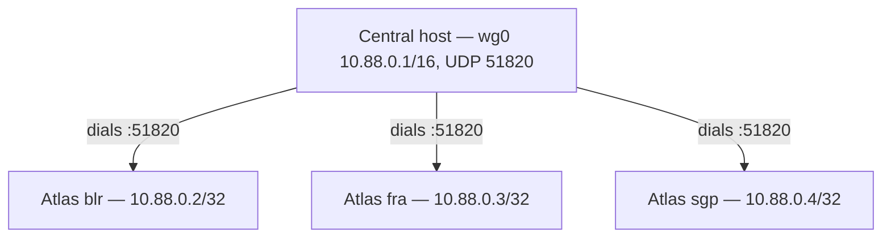

# Central Tunnel — the hub and the Register Atlas orchestration

Central is the **WireGuard hub** for every Atlas cluster. Each Atlas management
plane is reachable only over the tunnel; Central drives registration end to end.
This is the Central side of the seam — the Atlas side (the inbound API, the host
firewall, the lockout-safe handshake) is in
[atlas/spec/21-tunnel.md](../../atlas/spec/21-tunnel.md), which is authoritative
where the two overlap.

## Topology



- One hub (the single Central Frappe host). Each Atlas is one `/32` peer.
- Tunnel CIDR `10.88.0.0/16`; hub `10.88.0.1`; Atlas peers allocated sequentially.
- The hub **dials** each spoke at `<atlas_public_ip>:51820` with
  `persistent-keepalive 25`. The spoke's public firewall allows only that UDP port.
- Hub single point of failure is accepted for v1; HA is deferred.

## Host execution on Central

Central has no host-exec today. It gets a **minimal local-task runner**, a sibling of
Atlas's `run_local_task`.

- **`central/central/host_task.py`** — runs one `central/scripts/*.py` as a local
  subprocess, records a **`Host Task`** audit row (script, status, stdout, stderr,
  exit_code, timings, triggered_by), and parses one structured result line. It
  **reuses Atlas's contract** verbatim — `--kebab-case` flags in, one `ATLAS_RESULT=`
  JSON line out ([atlas/spec/04-tasks.md](../../atlas/spec/04-tasks.md)) — rather than
  inventing a new one. Secrets travel in `env`, never argv.
- **Privilege:** a one-time, operator-installed sudoers drop-in
  (`/etc/sudoers.d/central-tunnel`) pins the exact privileged commands the hub scripts
  run (`wg`, `wg-quick`, `nft`, `systemctl`). The app never edits sudoers; staging the
  scripts + drop-in is an operator step, documented in the README.

### Hub scripts — `central/scripts/`

All sudoers-pinned, all run via `host_task`:

| Script | Does |
| --- | --- |
| `hub-up.py` | Idempotently create `wg0` from the hub private key, address `10.88.0.1/16`, listen port `51820`; enable `wg-quick@wg0` for reboot persistence. |
| `hub-peer-add.py` | `wg set wg0 peer <pubkey> allowed-ips <ip>/32 endpoint <atlas_public_ip:port> persistent-keepalive 25`, and persist to the `wg0` config. |
| `hub-peer-remove.py` | The inverse — remove the peer and de-persist. |

Key generation is `wg genkey`; the hub private-key file is `0600`, its path stored in
DB (the key itself never enters the DB).

## DocTypes

### Central Tunnel Settings (single)

The hub's identity and the allocation pool.

| Field | Meaning |
| --- | --- |
| `hub_private_key_path` | path to the `0600` hub private key on the host |
| `hub_public_key` | the hub's WireGuard public key (pushed to each Atlas) |
| `hub_endpoint` | the hub's public `ip:port` (pushed to each Atlas) |
| `listen_port` | hub `wg0` UDP listen port (`51820`) |
| `tunnel_cidr` | the pool (`10.88.0.0/16`) |
| `hub_status` | `Uninitialized` → `Active` |

- Action **Initialize Hub** → `hub-up.py`. Idempotent.
- **Next-free IP** is computed from the pool minus the `tunnel_ip`s already on
  `Atlas Instance` rows (`10.88.0.1` reserved for the hub).

### Atlas Instance (extended)

Today `Atlas Instance` holds `region`, `base_url`, `status`, and a
hand-entered service `api_key` / `api_secret`. It gains:

| Field | Meaning |
| --- | --- |
| `admin_api_key`, `admin_api_secret` (Password) | the **Atlas admin** creds Central uses for **all** Central→Atlas calls |
| `tunnel_ip` | this Atlas's `/32` on `wg0` |
| `tunnel_url` | derived from `tunnel_ip` (e.g. `https://10.88.0.2`); the post-registration data path |
| `peer_public_key` | the Atlas's WireGuard public key (returned by `provision_tunnel`) |
| `peer_endpoint` | the Atlas's public `wg` endpoint (`<host-of-base_url-or-override>:<listen_port>`) |
| `service_user` | Link → User: the per-Atlas scoped Central service user |
| `tunnel_status` | `Unregistered` → `Provisioning` → `Active` |
| `skip_tunnel` (Check) | **local development only** — register the identity half without a WireGuard tunnel (see below) |

- `base_url` stays = the **public bootstrap URL** (used only during registration).
- The old hand-entered service `api_key` / `api_secret` are **migrated away**:
  Central→Atlas now authenticates with `admin_api_key` / `admin_api_secret`, and the
  per-Atlas service-user creds are generated by Central (below) and pushed to Atlas,
  not stored as inbound creds here.

## Per-Atlas Central service user

At registration Central creates a **dedicated, scoped** user
`atlas-<region>@<central-site>` (named after the Atlas instance it represents — this
is *that Atlas's* identity on Central, the principal it authenticates as when it
calls in) whose role grants **only** the inbound Atlas endpoints — `event`, `sizes`,
`images`, `ping` — and **nothing else**. Central generates its API key/secret, links
it on the `Atlas Instance` (`service_user`), and pushes the key/secret to Atlas in
`provision_tunnel`. Rotation = re-provision.

Alongside those creds, Central also mints a `webhook_secret` — the HMAC signing
key for the `event` webhook specifically (see `ATLAS_COORDINATION.md`'s wire
contract section). It has no natural home on the service user (it authenticates
a *request signature*, not a session), so it's stored directly on `Atlas Instance`
and pushed as `service_webhook_secret` in the same `provision_tunnel`/`link_local`
payload. `ping` still authenticates as the service user above; only `event` uses
the signature. Rotation is the same event as the service-user creds — one
re-register rotates all three.

This is distinct from the OAuth identity seam in [IAM.md](./IAM.md): that governs
*end-user* sessions; this is the *machine* identity one Atlas uses to call Central.

## Register Atlas — orchestration

The operator supplies `admin_api_key` + `admin_api_secret` + `base_url` + `region`,
then clicks **Register** on the `Atlas Instance`.

```mermaid
sequenceDiagram
    participant Op as Operator
    participant C as Central
    participant Hub as Central hub (wg0)
    participant A as Atlas (base_url → tunnel_ip)

    Op->>C: Register (admin creds + base_url + region)
    C->>A: ping (public base_url, admin auth)
    C->>C: ensure hub up; allocate tunnel_ip
    C->>C: create scoped service user
    C->>A: provision_tunnel(...) [public base_url]
    A-->>C: { wg_public_key, listen_port, tunnel_ip }
    C->>Hub: hub-peer-add.py (key + endpoint)
    C->>A: ping at tunnel_ip [over wg0 — verify]
    C->>A: confirm_tunnel() [over wg0]
    A-->>C: { tunnel_status: Active }
    C->>C: tunnel_status=Active; data path → tunnel_url
```

1. Validate creds; `ping` Atlas over **public** `base_url` (admin auth).
2. Ensure the hub is initialized; allocate the next-free `tunnel_ip`.
3. Create the scoped Central service user.
4. `provision_tunnel` over public `base_url` → Atlas brings up `wg0`, applies the
   firewall with the **auto-revert armed**, stores Central Settings, and returns its
   `wg_public_key` + listen port.
5. `hub-peer-add.py` on the hub with the returned key + the Atlas public endpoint.
6. **Verify:** `ping` Atlas at `tunnel_ip` over `wg0`.
7. `confirm_tunnel` over the tunnel → Atlas persists the firewall and cancels the
   auto-revert.
8. Set `tunnel_status = Active`; switch the instance's default data path to
   `tunnel_url`.

### Rollback (any failure before step 7)

- Atlas's armed auto-revert restores its public firewall and tears its tunnel on its
  own (the lockout-safety guarantee — Central need not be reachable for this).
- Central removes the half-added hub peer (`hub-peer-remove.py`) and deletes the
  scoped service user.
- Central raises a typed `TunnelRegistrationError`; the `Atlas Instance` stays
  `Unregistered` (or returns there) — no half state.

### Local development — `skip_tunnel`

WireGuard needs two real hosts, a sudoers drop-in, and a public firewall to lock —
none of which exist on a laptop. With `skip_tunnel` ticked on the `Atlas Instance`,
`register_atlas` takes a short branch that does only the **identity half**: `ping` over
`base_url`, create the scoped service user + rotate its creds, then
push those to Atlas via `provision_tunnel(..., skip_tunnel=1)` — which on the Atlas side
stores the creds and enables event reporting **without running any host script**. It
skips the hub check, IP allocation, hub peering, and the over-the-tunnel verify/confirm.
`tunnel_status` ends `Inactive` and `tunnel_url` is never set, so the data path stays on
the public `base_url` (the same fallback used for a real `Inactive` tunnel). There is no
host state to roll back, so a failure just propagates. This is a development convenience
with **no management-plane isolation** — never a production posture.

## Cut-over and retirement

- `AtlasClient` calls Atlas at `tunnel_url` (over `wg0`) with the **admin** token once
  `Active`; `base_url` is used only during bootstrap. The command surface (VM
  lifecycle, `run_doc_method`) and the reconcile read are unchanged in shape.
- Inbound `central.api.atlas.register` becomes a no-op / is removed; `event` is
  unchanged (now authenticated as the per-Atlas service user).

## Testing

- **Unit:** IP allocation; service-user creation + scoping; the full `Register`
  orchestration against a faked `AtlasClient` + faked hub scripts; rollback at each
  failure point.
- **End-to-end (two hosts):** see
  [atlas/spec/21-tunnel.md § Testing](../../atlas/spec/21-tunnel.md#testing) — one
  shared two-host drill proves both sides.

## Deferred

- Hub HA (single hub for v1).
- Surfacing `public_allow_ports` / break-glass in the UI.
- Durable, queued re-dial of a spoke whose public IP changes (today: operator
  re-registers, or updates `peer_endpoint` + re-runs `hub-peer-add`).

## Operator runbook — setting it up

This is the practical sequence to put one or more Atlas behind the tunnel. The
Central host is the WireGuard hub; each Atlas is a `/32` spoke. Everything is driven
from the Central Desk; the only thing done *on* a host is the one-time operator
install below.

### 1. One-time host install (each host, by an operator — the app never does this)

Both the Central host and every Atlas host run privileged `wg`/`nft`/`systemd`
commands as sudoers-pinned scripts. Install the pins (and on Atlas, the fail-closed
boot unit) once, as the bench OS user (`frappe` below — change to match your bench):

- **Central host** — `wireguard-tools` installed; then
  ```
  sudo install -m 0440 -o root -g root \
      apps/central/scripts/sudoers.d/central-tunnel /etc/sudoers.d/central-tunnel
  sudo visudo -cf /etc/sudoers.d/central-tunnel
  ```
- **Each Atlas host** — `wireguard-tools` + `nftables` installed; then
  ```
  sudo install -m 0440 -o root -g root \
      apps/atlas/scripts/sudoers.d/atlas-tunnel /etc/sudoers.d/atlas-tunnel
  sudo visudo -cf /etc/sudoers.d/atlas-tunnel
  sudo install -m 0644 apps/atlas/scripts/systemd/atlas-mgmt-firewall.service \
      /etc/systemd/system/ && sudo systemctl daemon-reload
  ```

### 2. Initialize the hub (Central Desk, once)

`Central Tunnel Settings` (single) → set **Hub Private Key Path** (a `0600` path on
the Central host, e.g. `/etc/wireguard/hub.key`) and **Hub Endpoint**
(`<central-public-ip>:51820`); CIDR `10.88.0.0/16`, port `51820`, interface `wg0`
are the defaults. **Save**, then **Initialize Hub** → brings up `wg0` at `10.88.0.1`
and records the hub's public key. Idempotent.

### 3. Register an Atlas (per Atlas)

On the Atlas, create an **admin API key/secret** for a System Manager (User → API
Access → Generate Keys). Then on the Central Desk create an **Atlas Instance**:

| Field | Value |
| --- | --- |
| Region | unique name, e.g. `blr` (also the record name) |
| Base URL | the Atlas's public URL, e.g. `https://blr.atlas.example.com` |
| Admin API Key / Secret | the Atlas admin creds from above |

**Save → Register.** This runs the whole handshake: allocate the next free `/32`,
mint a scoped service user, `provision_tunnel` over the public `base_url` (Atlas
brings up its spoke `wg0`, **locks its public interface** with an armed auto-revert),
`hub-peer-add`, verify over the tunnel, `confirm_tunnel`. Ends `Tunnel Status =
Active`, and the data path for this instance switches to `tunnel_url`
(`http(s)://<tunnel_ip>`).

> Once Active the Atlas's public Desk/API is **dark** — it is reachable only over the
> tunnel, from Central. Drive everything from the Central Desk thereafter. If Register
> *fails* before confirm, the Atlas's armed auto-revert reopens its public side on its
> own within a few minutes.

### 4. Multiple Atlas

Repeat step 3 for each Atlas — each gets the next sequential `/32` (`10.88.0.2`,
`10.88.0.3`, …; allocation is locked + `tunnel_ip` is unique, so concurrent
registrations can't collide), its own scoped service user, and its own hub peer. The
hub accumulates one peer per spoke.

### 5. Remove / re-tunnel

**Remove Tunnel** (shown when Active) strips the runtime tunnel — reverts the Atlas
firewall, drops its `wg0`, removes the hub peer — but **keeps the instance
registered** (`Tunnel Status = Inactive`, retaining the service user and
the allocated `tunnel_ip`). The data path falls back to the public `base_url`.
**Register** again (shown as *Register (re-tunnel)* when Inactive) brings the tunnel
back up reusing the same identity + address.

### 6. Break-glass — recovering a stranded Atlas

If an Atlas is locked but its Central record is lost (so there's no Remove Tunnel
button), it is still reachable over the tunnel: from the Central host, authenticate
with the Atlas admin creds and POST
`atlas.atlas.api.central_link.deprovision_tunnel` at `http(s)://<tunnel_ip>` — it
reverts the firewall first, so the public side reopens. Last resort: the host's
serial console — `nft delete table inet atlas_mgmt`, `systemctl disable
atlas-mgmt-firewall.service`, `rm -f /etc/atlas/mgmt-firewall.nft`.
